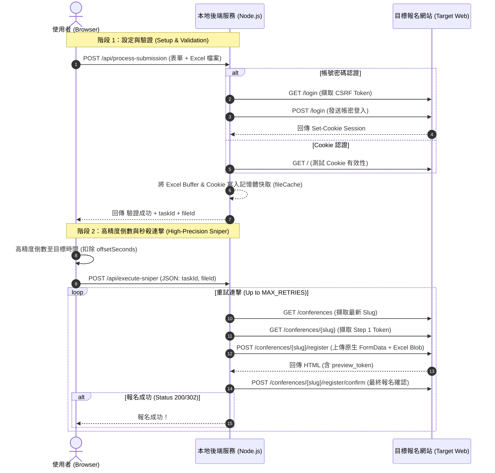

# ⚡ 高精度研討會自動搶票平台 (Auto Reservation & Conference Sniper)


專為熱門研討會與活動報名設計的高效能秒殺搶票系統。採用 Node.js、Express 與 TypeScript 構建，具備毫秒級高精度倒數、TCP/TLS 連線重用池、動態 Slug 擷取與多段式表單極速連擊提交功能。

---

## 🌟 核心特色 (Key Features)

- ⏱️ **毫秒級高精度倒數與提前發射 (Precision Countdown & Offset)**
  - 支援設定目標時間（GMT+8），並可自訂毫秒級提前發射偏移量（如提前 `0.08` 秒），完美對齊網路 Ping 延遲與伺服器處理時間。
- ⚡ **TCP/TLS Keep-Alive 連線池重用**
  - 透過 `agentkeepalive` 重用 HTTP/HTTPS TCP 連線與 TLS 握手，省去每次請求 `30~50ms` 的連線延遲。
- 🔑 **雙重身份驗證模式 (Dual Authentication Modes)**
  - **帳號密碼自動登入**：自動向登入端點獲取 CSRF Token、完成身份驗證並自動保存 Cookie。
  - **Cookie 直連認證**：支援直接填入網頁 Cookie (`_session` / `cf_clearance`) 免登入極速觸發。
- 🎯 **動態研討會 Slug 與 Token 解析**
  - 自動請求活動首頁，動態鎖定最新活動 Slug（如 `2026-sister-blending-conference`）。
  - 自動提取 Step 1 CSRF Token 與 Step 2 Preview Token，確保多階段報名流程流暢執行。
- 🚀 **零磁碟 I/O 記憶體快取 (In-Memory Buffer Cache)**
  - 上傳之 Excel (.xlsx) 報名檔與設定檔於預備階段即寫入 Node.js 記憶體快取，連擊觸發時達到零磁碟存取延遲。
- ⚙️ **可自訂頻率與重試機制 (Custom Retry Strategy)**
  - 提供前端彈性設定**重試次數**與**重試間隔（毫秒）**（預設 15 次，間隔 100ms）。
- 🖥️ **高科技/賽博朋克風格 UI 與即時日誌 (Tech-Lab UI & Live Logs)**
  - 採用 JetBrains Mono 等購字型與 High-Tech 視覺風格，提供毫秒級 `[HH:mm:ss.SSS]` 即時日誌輪詢。

---

## 🛠️ 技術棧 (Tech Stack)

### 後端 (Backend)
- **Runtime**: Node.js (v18+)
- **Language**: TypeScript (`tsx`)
- **Server Framework**: Express v5
- **HTTP Client**: `got` (支援 HTTP/2, Connection Pooling, Native Web FormData)
- **Connection Agent**: `agentkeepalive` (HttpAgent / HttpsAgent)
- **File Upload**: `multer` (MemoryStorage)

### 前端 (Frontend)
- **Core**: Vanilla HTML5 / JavaScript (ES6+)
- **Styling**: Bootstrap 5 + Custom Cyberpunk / High-Tech Lab Light CSS
- **Font**: Google Fonts - `JetBrains Mono`

---

## 📐 系統架構與搶單流程 (Architecture & Workflow)



---

## 🚀 快速開始 (Quick Start)

### 1. 安裝套件
使用 npm 安裝所需依賴：
```bash
npm install
```

### 2. 啟動開發伺服器
以 `tsx watch` 模式啟動服務，支援存檔自動重載：
```bash
npm run dev
```

伺服器預設於 `http://localhost:3000` 啟動。

### 3. 生產環境編譯與啟動
```bash
npm run build
npm start
```

---

## 📖 使用指南 (User Guide)

1. **開啟控制台**：瀏覽器造訪 `http://localhost:3000`。
2. **填寫參數**：
   - **重試次數 / 重試間隔**：預設為 `15` 次、`100` 毫秒。
   - **提前發射偏移量**：預設 `0.08` 秒（可依網路 RTT 調整）。
   - **開搶目標時間**：選擇台灣時間 (GMT+8) 開搶時間。
   - **選擇大區與召會 ID**：選擇對應區域與 Church ID。
   - **上傳報名檔**：選擇點收好的 `.xlsx` 檔案。
   - **選擇認證方式**：可使用「帳號密碼」自動登入或「Cookie 認證」。
3. **進入倒數**：點擊「同意並進入倒數計時」，系統會先執行預查驗證，通過後自動啟動高精度毫秒倒數。
4. **即時監控**：倒數歸零後將自動觸發後端連發，可於右側/下方即時日誌視窗查看毫秒級執行過程。

---

## 📄 專案結構 (Directory Structure)

```text
auto_reservation/
├── public/
│   └── index.html         # 前端 Cyberpunk 控制台介面與倒數邏輯
├── server.ts              # Express 主程式、Keep-Alive 代理與秒殺連擊邏輯
├── package.json           # 專案套件設定檔
├── tsconfig.json          # TypeScript 設定檔
└── README.md              # 說明文件
```

---

## ⚠️ 免責聲明 (Disclaimer)

本專案僅供技術研究、網路效能測試與學術交流使用。使用本軟體進行任何網站搶票行為時，請遵循相關網站之服務條款與法律規範。
